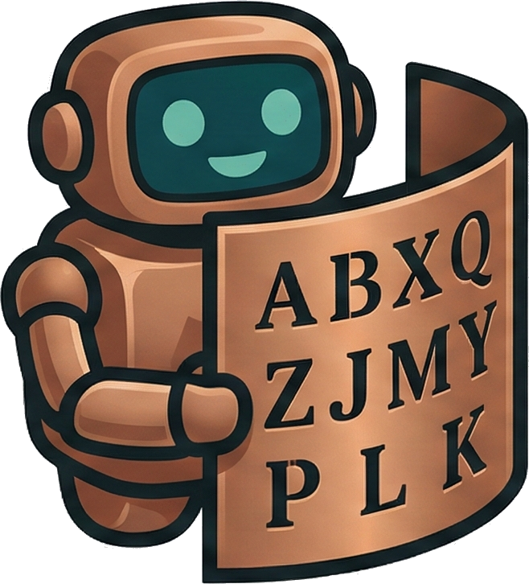

<p align="center">
  
</p>

<h1 align="center">KryptosBot</h1>

<p align="center">
  <strong>An open-source computational analysis of Kryptos K4</strong><br>
  668 billion+ configurations tested. 188 cipher families eliminated. Zero breakthroughs yet.
</p>

<p align="center">
  <a href="https://kryptosbot.com">kryptosbot.com</a> &middot;
  <a href="https://kryptosbot.com/workbench/">Workbench</a> &middot;
  <a href="https://kryptosbot.com/submit/">Submit a Theory</a> &middot;
  <a href="https://kryptosbot.com/browse/">Browse Eliminations</a>
</p>

---

## What is this?

**Kryptos** is an encrypted sculpture at CIA headquarters in Langley, Virginia. Installed in 1990 by artist Jim Sanborn with the help of CIA cryptographer Ed Scheidt, it contains four encrypted messages. The first three (K1-K3) were solved in 1999. **The fourth, K4, remains unsolved after 35 years.**

This repository is a systematic attempt to solve K4 — or at least to rigorously document what doesn't work.

### K4 at a glance

| | |
|---|---|
| **Ciphertext** | `OBKRUOXOGHULBSOLIFBBWFLRVQQPRNGKSSOTWTQSJQSSEKZZWATJKLUDIAWINFBNYPVTTMZFPKWGDKZXTJCDIGKUHUAUEKCAR` |
| **Length** | 97 characters (prime), all 26 letters present |
| **Known plaintext** | Positions 21-33: `EASTNORTHEAST`, Positions 63-73: `BERLINCLOCK` |
| **IC** | 0.0361 (below random expectation of 0.0385) |

## What's here

```
src/kryptos/          # Core library — cipher transforms, scoring, constraints
  kernel/             #   Pure computation: alphabets, transforms, Bean constraints
  pipeline/           #   Candidate evaluation and parallel sweep runner
  scoring/            #   Crib scoring, n-gram analysis, IC
  novelty/            #   Hypothesis generation and triage
  corpus/             #   Egyptological corpus for running-key testing
  cli/                #   Command-line tools (sweep, reproduce, novelty, report)

scripts/              # 600+ experiment scripts organized by cipher family
  substitution/       #   Vigenere, Beaufort, Hill, monoalphabetic, etc.
  transposition/      #   Columnar, rail fence, route, grid-based
  fractionation/      #   Bifid, Trifid, ADFGVX, Playfair
  grille/             #   Cardan grille, turning grille, tableau overlays
  polyalphabetic/     #   Kasiski analysis, period detection
  running_key/        #   Book ciphers, thematic running keys
  encoding/           #   Morse (K0), misspelling analysis, binary tests
  ...and more

tests/                # Unit, QA, and benchmark tests
bench/                # Cipher-solving benchmark framework
site_builder/         # Static site generator for kryptosbot.com
api/                  # FastAPI backend (theory classifier, submission queue)
kryptosbot/           # Multi-agent campaign runner (Claude Agent SDK)
```

## Quick start

**Python 3.11+** required. No external runtime dependencies — stdlib only. `pytest` is the only dev dependency.

```bash
# Clone
git clone https://github.com/jcolinpatrick/kryptos.git
cd kryptos

# Run tests
PYTHONPATH=src pytest tests/

# Run an experiment
PYTHONPATH=src python3 -u scripts/substitution/e_s_24_thematic_keys.py

# Try the workbench cipher solver
PYTHONPATH=src python3 -m kryptos sweep <config.toml>

# Check environment health
PYTHONPATH=src python3 -m kryptos doctor
```

## Scoring system

Every candidate decryption is scored against known constraints:

| Score | Classification | Meaning |
|-------|---------------|---------|
| 0-9   | Noise         | Expected random performance |
| 10-17 | Interesting   | Worth logging, likely noise |
| 18-23 | Signal        | Statistically significant |
| 24    | Breakthrough  | All cribs match — potential solution |

The score is based on crib consistency (do the known plaintext positions produce a valid keystream?), Bean constraints (equality/inequality relationships between key positions), index of coincidence, and n-gram quality.

**After 668 billion+ configurations: the best score achieved is noise-level.** No single-layer classical cipher produces a meaningful result on K4.

## What's been eliminated

The [kryptosbot.com](https://kryptosbot.com/browse/) site documents 188 formal eliminations across 7 categories:

- **Substitution** — Vigenere, Beaufort, Quagmire, Hill, Caesar, mixed alphabets
- **Transposition** — Columnar, double-columnar, AMSCO, rail fence, route, grille
- **Fractionation** — Bifid, Trifid, ADFGVX, Playfair, two-square, four-square
- **Multi-layer** — Substitution + transposition combinations, null extraction, cascades
- **Key models** — Running keys, autokey, progressive, date-derived, sculpture-derived
- **Bespoke** — Morse-derived parameters, Weltzeituhr, DRYAD charts, NATO/COMSEC
- **Uncategorized** — Novel approaches not fitting standard categories

## Current hypotheses

The leading working model (not proven):

1. **Two systems confirmed** — Sanborn's dedication speech states K4 uses "two systems of enciphering," distinct from the Vigenere used for K1-K3
2. **73-character hypothesis** — Sanborn's working notes suggest K4 may be 73 characters with 24 nulls inserted
3. **Cardan grille as selection mask** — The grille may identify which 73 of the 97 carved characters are real ciphertext
4. **W-as-delimiter** — Five W's in the ciphertext bracket the known cribs, possibly acting as word separators

See [docs/research_questions.md](docs/research_questions.md) for the full list of open questions.

## Contributing

The whole point of open-sourcing this is to get more eyes on K4.

**Try a theory:** Use the [browser workbench](https://kryptosbot.com/workbench/) — no install needed. Apply transpositions and substitutions, see crib scores in real time.

**Submit a theory:** Use [kryptosbot.com/submit](https://kryptosbot.com/submit/) to check if your idea has already been tested. Novel feasible theories are queued for evaluation.

**Write an experiment:** See any script in `scripts/` for the pattern. Import constants from `kryptos.kernel.constants`, implement an `attack()` function, check results against the scoring system.

**Report an error:** If you think an elimination is wrong, [open an issue](https://github.com/jcolinpatrick/kryptos/issues/new).

## Key references

- [Bean 2021](https://eprint.iacr.org/2021/1549) — Constraint analysis of K4 keystream
- [Elonka Dunin's Kryptos page](https://elonka.com/kryptos/) — Community hub and transcription
- [Ed Scheidt dossier](reference/ed_scheidt_dossier.md) — What the co-creator has revealed
- [Sanborn's open letter (Aug 2025)](reference/sanborn_open_letter_aug2025.md) — AI verification, K5 confirmed

## Credits

Built by **Colin Patrick** (human lead) and **Claude** (computational partner, Anthropic).

The sculpture *Kryptos* was created by **Jim Sanborn** with cryptographic assistance from **Ed Scheidt** (retired CIA Crypto Center chief).

---


