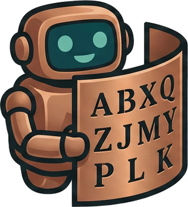

<p align="center">
  
</p>

<h1 align="center">KryptosBot</h1>

<p align="center">
  <strong>An open-source computational analysis of Kryptos K4</strong><br>
  671 billion+ configurations evaluated across recorded experiments. 1,070+ experiment scripts. Zero verified breakthroughs.
</p>

<p align="center">
  <a href="https://www.kryptosbot.com">www.kryptosbot.com</a> &middot;
  <a href="https://www.kryptosbot.com/workbench/">Workbench</a> &middot;
  <a href="https://www.kryptosbot.com/submit/">Submit a Theory</a> &middot;
  <a href="https://www.kryptosbot.com/browse/">Browse Eliminations</a>
</p>

---

## What is this?

**Kryptos** is an encrypted sculpture at CIA headquarters in Langley, Virginia. Installed in 1990 by artist Jim Sanborn with cryptographic assistance from Ed Scheidt (retired Chairman of the CIA Cryptographic Center), it contains four encrypted messages. The first three (K1–K3) were solved in the 1990s: first by a small NSA team in late 1992 (made public in 2000), then independently by CIA analyst David Stein in 1998 and by Jim Gillogly in 1999, the first public solution. **The fourth, K4, has never been publicly solved.**

In September 2025 the writers Jarett Kobek and Richard Byrne found scrambled strips of K4's plaintext in Sanborn's papers at the Smithsonian's Archives of American Art. Sanborn confirmed the find but said it does not reveal the coding method or key, and the plaintext has not been published. This project does not have it.

This repository is a systematic attempt to solve K4. At a minimum, it rigorously documents what doesn't work within clearly stated assumptions. **No K4 solution is claimed by this project; no real-K4 progress is currently claimed; K4 is not proven impossible. Public-data-only K4 is judged underdetermined from the current public evidence pool; see [`docs/REAL_K4_CURRENT_POSITION.md`](docs/REAL_K4_CURRENT_POSITION.md) (June 2026) for the status report.**

### K4 at a glance

| | |
|---|---|
| **Ciphertext** | `OBKRUOXOGHULBSOLIFBBWFLRVQQPRNGKSSOTWTQSJQSSEKZZWATJKLUDIAWINFBNYPVTTMZFPKWGDKZXTJCDIGKUHUAUEKCAR` |
| **Length** | 97 characters (prime), all 26 letters present |
| **Known plaintext** | Plaintext positions 21-33: `EASTNORTHEAST`, 63-73: `BERLINCLOCK` (0-indexed; released by Sanborn) |
| **IC** | 0.0361 (below the random expectation of 0.0385; not statistically significant at 97 letters) |

## What's here

```
src/kryptos/          # Core library: cipher transforms, scoring, constraints
  kernel/             #   Pure computation: alphabets, transforms, Bean constraints
    scoring/          #     Crib scoring, n-gram analysis, IC
  pipeline/           #   Candidate evaluation and parallel sweep runner
  novelty/            #   Hypothesis generation and triage
  corpus/             #   Egyptological corpus for running-key testing
  cli/                #   Command-line tools (sweep, reproduce, novelty, report)

scripts/              # 1,070+ experiment scripts organized by cipher family
  substitution/       #   Vigenere, Beaufort, Hill, monoalphabetic, etc.
  transposition/      #   Columnar, rail fence, route, grid-based
  fractionation/      #   Bifid, Trifid, ADFGVX, Playfair
  grille/             #   Cardan grille, turning grille, tableau overlays
  polyalphabetic/     #   Kasiski analysis, period detection
  running_key/        #   Book ciphers, thematic running keys
  encoding/           #   Morse (K0), misspelling analysis, binary tests
  campaigns/          #   Structured multi-stage campaigns (preregistered)
  ...and more

kryptosbot/           # Multi-agent research controller (Claude Agent SDK):
                      #   theorist/critic/red-team cycle, typed hypothesis DSL,
                      #   kernel-verified dispatch, provenance-gated claims

tests/                # 2,200+ unit, QA, and benchmark tests (plus 2,700+ under kryptosbot/tests/)
bench/                # Cipher-solving benchmark framework + K4Bench synthetic calibration suite
ops/site_builder/     # Static site generator for kryptosbot.com
ops/api/              # FastAPI backend (theory classifier, submission queue)
ops/deploy/           # Site deployment (S3 + CloudFront) and route verification
ops/publish/          # Content-scan guard run by the pre-push hook
```

## Quick start

**Python 3.11+** required. The repo uses a small Python dependency stack for testing, scientific computing, web/API serving, and agent tooling; see [requirements.txt](requirements.txt).

```bash
# Clone
git clone https://github.com/jcolinpatrick/kryptos.git
cd kryptos

# Run tests
PYTHONPATH=src pytest tests/

# Run an experiment
PYTHONPATH=src python3 -u scripts/substitution/e_atbash_01_keyword_decrypt.py

# Try the workbench cipher solver
PYTHONPATH=src python3 -m kryptos sweep <config.toml>

# Check environment health
PYTHONPATH=src python3 -m kryptos doctor
```


## Scoring system

Every candidate decryption is scored against known constraints:

| Score | Classification | Meaning |
|-------|---------------|---------|
| 0-9   | Noise         | Expected random performance |
| 10-17 | Interesting   | Worth logging, likely noise |
| 18-23 | Signal        | Unusual within tested scope; requires follow-up and validation |
| 24    | Breakthrough  | All cribs match; potential solution |

The score is based on crib consistency (do the known plaintext positions produce a valid keystream?), Bean constraints (equality/inequality relationships between key positions), index of coincidence, and n-gram quality.

**After 671 billion+ configurations: no verified solution has emerged within the tested families and parameter ranges.** Many standard bounded classical families have been saturated under direct positional correspondence, but that does not rule out multi-layer, procedural, or differently aligned constructions.

## What's been eliminated

The [kryptosbot.com](https://www.kryptosbot.com/browse/) site currently documents 551 recorded eliminations across 7 categories (count as of 2026-10-04; the site rebuilds from the same data in this repo):

- **Substitution.** Vigenere, Beaufort, Quagmire, Hill, Caesar, mixed alphabets.
- **Transposition.** Columnar, double-columnar, AMSCO, Myszkowski, rail fence, route, grille.
- **Fractionation.** Bifid, Trifid, ADFGVX, Playfair, four-square (structurally eliminated under direct correspondence).
- **Multi-layer.** Substitution + transposition combinations, null extraction, three-layer cascades.
- **Key models.** Running keys, autokey (structurally eliminated), progressive, Fibonacci, date-derived.
- **Bespoke.** RS44, VIC, Wheatstone, Weltzeituhr, DRYAD charts, NATO/COMSEC.
- **Uncategorized.** Morse-derived, encoding schemes, sculpture-physical hypotheses.

**Important caveat:** These eliminations are always scoped to the assumptions actually tested. Single-layer eliminations do not rule out the same cipher family as one layer of a multi-layer construction.

## Working hypotheses

None of these are proven. They represent live hypothesis surfaces or residual coverage gaps. Status as of October 2026.

1. **More than one layer, with letters moved.** Every simple model that keeps plaintext letter *i* under carved letter *i* has failed, and a rearrangement alone cannot work either: the carved text has 2 E's where the known plaintext needs 3, so a substitution layer exists. The live frame is a substitution combined with a rearranging layer. Periodic keys read through many rearrangement families (keyed columnar, routes, Sanborn's own K3-style grid turns) have been closed within the tested widths and key lengths, as has an English running key with a width-31 grid turn (2026-10-04, [pre-registration and result](docs/campaigns/w31_running_key_prereg_2026_10_04.md)). Open: non-English or generated keys, keyword-ordered or repeated rearrangements, and null letters.
2. **Two systems.** Sanborn has publicly said K4 uses "two systems of enciphering." K1 and K2 use a keyed Vigenère on the KRYPTOS alphabet and K3 a transposition. The project treats the remark as **Tier-3 contextual hearsay** (claims-registry entries `C-SANBORN-01` and `C-SANBORN-02`): it admits many incompatible readings and has not yet produced a non-arbitrary mechanism. See the [pseudo-clue-pack admission standard](docs/REAL_K4_PSEUDO_CLUE_PACK_ADMISSION.md), rule 11.
3. **CT perturbation.** The canonical ciphertext could contain a small number of carving errors; K2 is known to have one (UNDERGRUUND). Every single-character variant was tested and closed clean-negative in May 2026, and a single error combined with a columnar transposition (with an optional periodic key) was closed at widths 2-13 in September 2026. The as-carved text is treated as authoritative.
4. **W positions.** Deleting the five carved `W`s (positions 20, 36, 48, 58, 74) removes the old width-21 vertical-bigram anomaly, but audits in May and September 2026 showed the anomaly responds to where letters are deleted, not to which letters. W-segmentation is no longer a primary anchor; it remains admissible inside multi-layer hypotheses.
5. **Null insertion or procedural markers.** Some positions may be filler or markers. The number, placement and interpretation remain unknown. The older statistical "null palette" family is retired and should not be treated as evidence.

Sanborn's own worksheets are now a source of method evidence. The published K1/K2 encoding chart shows the keyword being corrected in its first row (see [the chart note](docs/nyt_k1k2_chart_physical_layout_2026_09_19.md) and [the encoding-chart page](https://www.kryptosbot.com/encoding-chart/)). The K3 chart's grid route is documented in [docs/k3_chart_layout_and_route_2026_09_19.md](docs/k3_chart_layout_and_route_2026_09_19.md).

See [docs/research_questions.md](docs/research_questions.md) for the full list of open questions.

## What is public, and what is not

As of June 2026 this repository is published in full as a gift to the
Kryptos community, including the complete `kryptosbot/` multi-agent
controller and the full research history. Exactly four classes stay out
of the public repo:

1. **Agent and skill definitions** (`.claude/`): the precise prompt
   construction of the research agents stays private. The architecture
   they implement is fully visible in `kryptosbot/`.
2. **Secrets**: API keys and `.env` files.
3. **Local reference material** (`reference/`, `archive/`,
   `analysis_runs/`): third-party books and scans (some copyrighted),
   bulk photo corpora, and community-thread archives. The photographs
   the project shares are the ones published on
   [kryptosbot.com/archive](https://www.kryptosbot.com/archive/).
4. **Machine outputs**: multi-gigabyte run outputs, caches, and build
   artifacts. Result summaries that feed the site live in `results/`
   and `docs/`.

While the Paradigm Kryptos CTF contest is live, its contest-scoped
material is also held back.

## Contributing

The whole point of open-sourcing this is to get more eyes on K4.

**Try a theory:** Use the [browser workbench](https://www.kryptosbot.com/workbench/), no install needed. Apply transpositions and substitutions, see crib scores in real time.

**Submit a theory:** Use [kryptosbot.com/submit](https://www.kryptosbot.com/submit/) to check if your idea has already been tested. Novel feasible theories are queued for evaluation.

**Write an experiment:** See any script in `scripts/` for the pattern. Import constants from `kryptos.kernel.constants`, implement an `attack()` function, check results against the scoring system.

**Report an error:** If you think an elimination is wrong, [open an issue](https://github.com/jcolinpatrick/kryptos/issues/new).

## Project research-state documents

- [Real-K4 current position](docs/REAL_K4_CURRENT_POSITION.md) (June 2026): what KryptosBot can and cannot do, why public-data-only K4 is judged underdetermined, and the explicit non-claim statement.
- [Evidence gap register](docs/REAL_K4_EVIDENCE_GAP_REGISTER.md): ten open evidence gaps (GAP-01…GAP-10) with admission-grade closure conditions.
- [Evidence acquisition plan](docs/REAL_K4_EVIDENCE_ACQUISITION_PLAN.md): recommended first action and priority order across the high-priority gaps.
- [Pseudo-clue-pack admission standard](docs/REAL_K4_PSEUDO_CLUE_PACK_ADMISSION.md): eleven-rule admission gate including the Sanborn public-comment doctrine.

## Key external references

- [Bean 2021](https://ecp.ep.liu.se/index.php/histocrypt/article/view/153): "Cryptodiagnosis of Kryptos K4," HistoCrypt 2021.
- [Elonka Dunin's Kryptos page](https://elonka.com/kryptos/): community hub and transcription.
- Ed Scheidt interviews and Sanborn's August 2025 open letter: summarized on [kryptosbot.com/about-kryptos](https://www.kryptosbot.com/about-kryptos/). (The project's local `reference/` corpus of third-party source material is not in the public repo for copyright reasons.)

## Credits

Built by **Colin Patrick** (human lead) and **Claude** (computational partner, Anthropic).

The sculpture *Kryptos* was created by **Jim Sanborn** with cryptographic assistance from **Ed Scheidt** (retired Chairman of the CIA Cryptographic Center).

---
